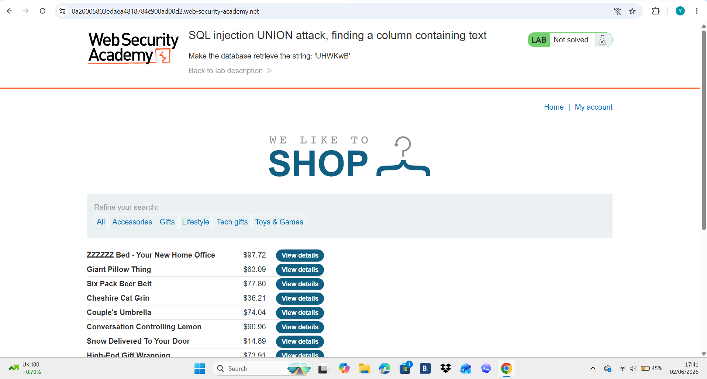
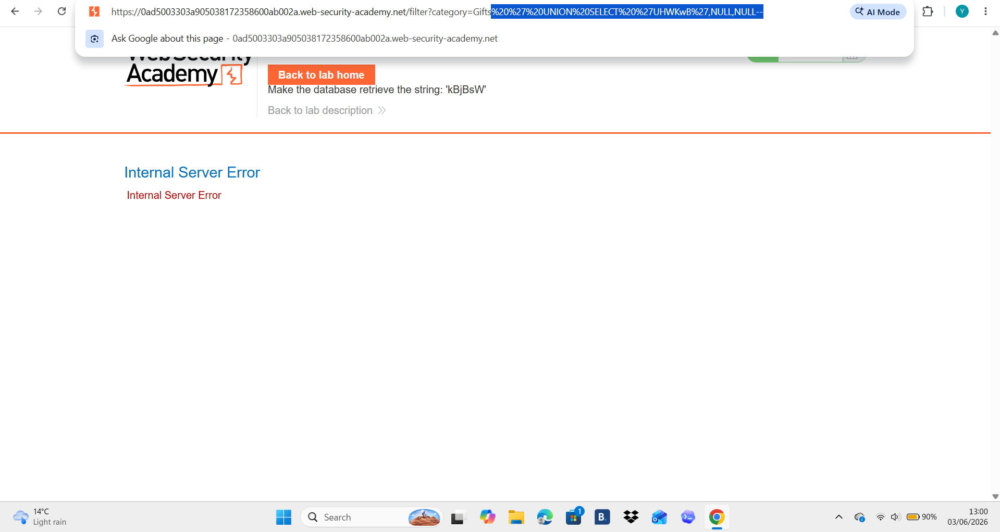
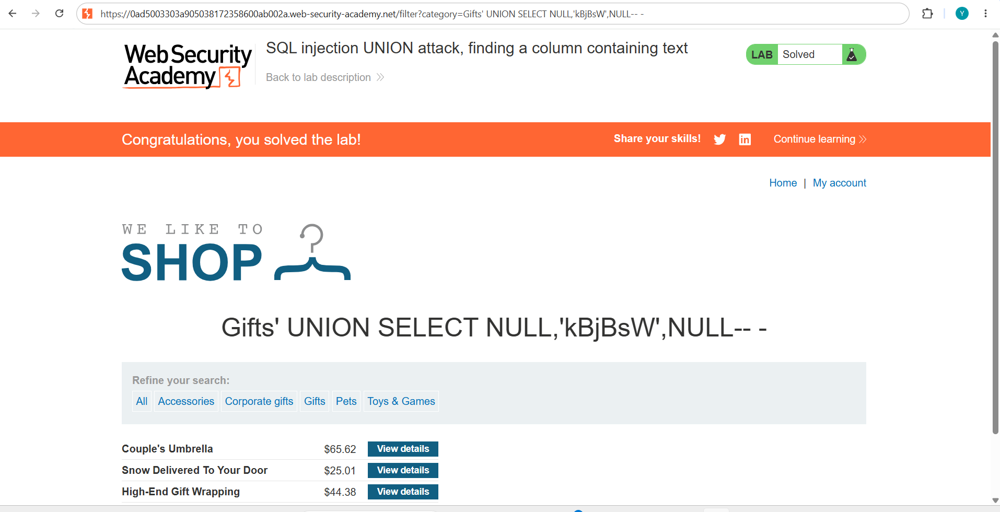

# SQL Injection UNION Attack – Finding a Column Containing Text

## Overview

This lab demonstrates how to use a UNION-based SQL injection attack to identify which column in a SQL query accepts string data. Once the correct column is identified, a supplied text value can be returned from the database and displayed within the application's response.

## Objective

The objective of this lab was to retrieve the value:

```sql
'UHWKwB'
```

by injecting a UNION SELECT statement into the vulnerable category parameter.

## Method

### Step 1 – Access the vulnerable page

The application allowed filtering products by category through a URL parameter.

### Step 2 – Determine the number of columns

A UNION SELECT statement with NULL values was used to determine the number of columns returned by the query.

### Step 3 – Test each column for string compatibility

The provided string was inserted into each column position until it was successfully displayed on the page.

Successful payload:

```sql
' UNION SELECT NULL,'kBjBsW',NULL--
```

### Step 4 – Verify the result

The supplied text appeared within the application's response, confirming that the second column accepted string data.

## Screenshots

### Lab Homepage



### Initial Error Response



### Successful SQL Injection



## Result

The lab was successfully completed by identifying a column that accepted text data and using a UNION SELECT statement to retrieve the required value from the database.

## Security Impact

An attacker can use UNION-based SQL injection to extract sensitive information from a database, including usernames, passwords, email addresses, and other confidential records if proper input validation is not implemented.

## Mitigation

* Use parameterised queries (prepared statements).
* Validate and sanitise user input.
* Apply the principle of least privilege to database accounts.
* Disable verbose database error messages.
* Implement a Web Application Firewall (WAF).

## Skills Demonstrated

* SQL Injection
* UNION-based SQL Injection
* Column Enumeration
* Data Type Identification
* Web Application Security Testing
* Burp Suite
* OWASP Top 10 (A03: Injection)
